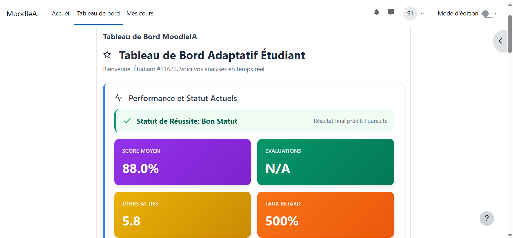
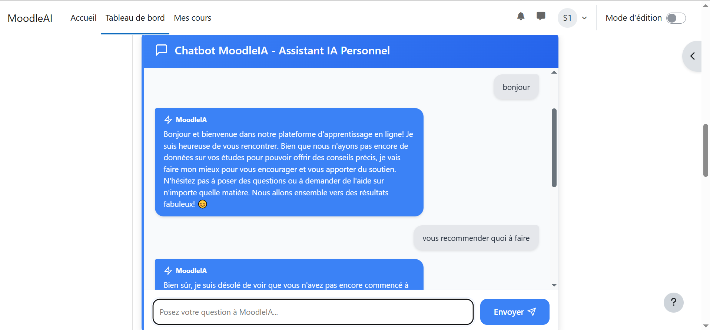
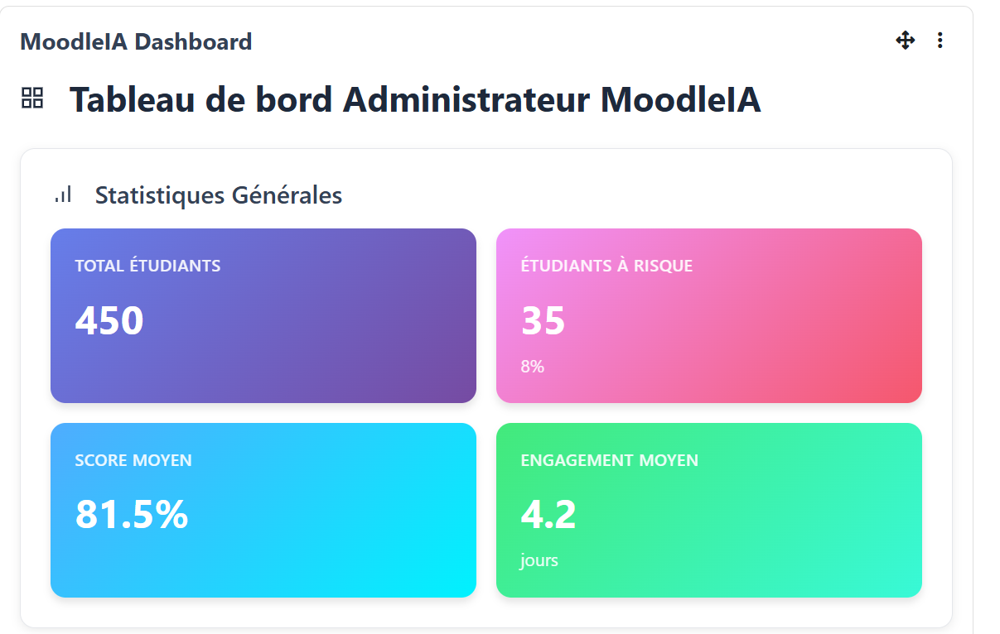
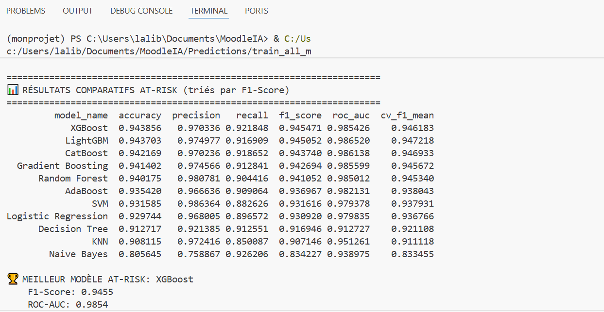
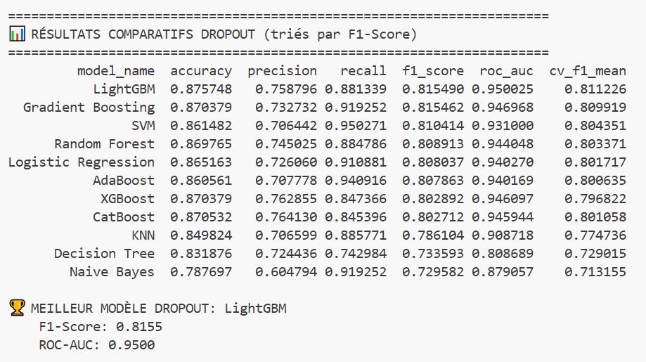
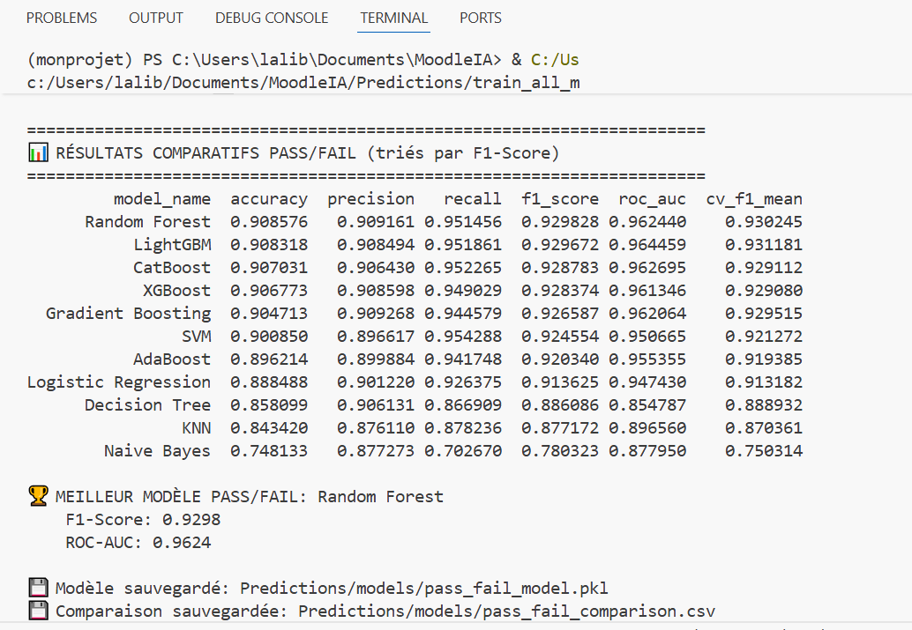
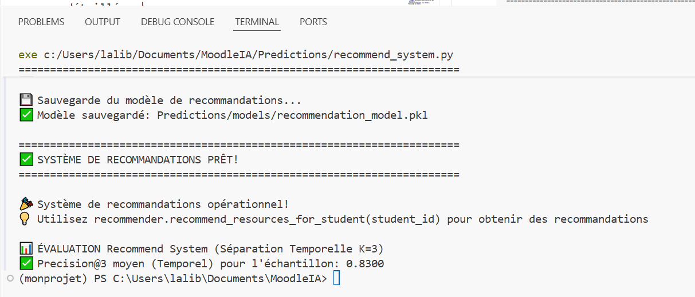

# MoodleIA - Système d'Apprentissage Adaptatif Intelligent

[](https://www.python.org/)
[](https://flask.palletsprojects.com/)
[](https://scikit-learn.org/)
[](https://huggingface.co/)

## 📋 Table des matières
- [Présentation](#-présentation)
- [Fonctionnalités principales](#-fonctionnalités-principales)
- [Captures d'écran](#-captures-décran)
- [Architecture du système](#-architecture-du-système)
- [Technologies utilisées](#-technologies-utilisées)
- [Installation](#-installation)
- [Structure du projet](#-structure-du-projet)
- [Utilisation](#-utilisation)
- [API REST](#-api-rest)
- [Intégration Moodle](#-intégration-moodle)
- [Résultats et performances](#-résultats-et-performances)
- [Auteur](#-auteur)

---

## 🎯 Présentation

**MoodleIA** est un système d'apprentissage adaptatif intelligent basé sur l'IA et le Machine Learning, conçu pour être intégré à Moodle. Il utilise le dataset **OULAD (Open University Learning Analytics Dataset)** pour prédire les performances des étudiants et fournir des recommandations personnalisées.

### Objectifs du projet
- **Prédire** les étudiants à risque d'échec ou d'abandon
- **Recommander** des ressources pédagogiques personnalisées
- **Assister** les étudiants via un chatbot IA intelligent
- **Alerter** les administrateurs pour interventions ciblées

---

## ✨ Fonctionnalités principales

### 1. Prédictions ML Multi-Tâches
- ⚠️ **Détection d'étudiants à risque** (At-Risk Prediction)
- 🚪 **Prédiction d'abandon** (Dropout Prediction)
- ✅ **Prédiction Pass/Fail**
- 📝 **Prédiction de performance aux quiz**

### 2. Système de Recommandations
- 🤝 **Collaborative Filtering** : Basé sur des étudiants similaires
- 📚 **Content-Based Filtering** : Selon les ressources consultées
- 🎯 **Performance-Based** : Inspiré des étudiants performants

### 3. Chatbot IA Personnalisé
- 🤖 Propulsé par **Mistral-7B-Instruct** (HuggingFace API)
- 💬 Réponses empathiques et contextualisées
- 📊 Intégration des données ML en temps réel

### 4. Tableaux de bord interactifs
- 👨‍🎓 **Dashboard Étudiant** : Vue personnalisée de ses performances
- 👨‍💼 **Dashboard Administrateur** : Statistiques globales + liste d'intervention

### 5. API REST complète
- 🔌 15+ endpoints pour intégration facile
- 🚀 Prédictions en temps réel
- 📦 Support batch processing

---

## 📸 Captures d'écran

### Interface Étudiant

<table>
  <tr>
    <td width="50%">
      <h4>📊 Dashboard Étudiant</h4>
      
      <p><i>Vue d'ensemble des performances avec score moyen, statut de réussite, jours actifs et taux de retard</i></p>
    </td>
    <td width="50%">
      <h4>⚠️ Alertes et Recommandations</h4>
      
      <p><i>Alertes personnalisées et ressources recommandées par l'IA basées sur le profil de l'étudiant</i></p>
    </td>
  </tr>
</table>

### Chatbot IA Personnel

<table>
  <tr>
    <td width="50%">
      <h4>🤖 Interface du Chatbot</h4>
      
      <p><i>Assistant IA conversationnel propulsé par Mistral-7B pour support personnalisé</i></p>
    </td>
    <td width="50%">
      <h4>💬 Conversation Interactive</h4>
      
      <p><i>Exemple de conversation contextuelle avec réponses basées sur les données ML</i></p>
    </td>
  </tr>
</table>

### Interface Administrateur

<table>
  <tr>
    <td width="50%">
      <h4>📈 Dashboard Administrateur</h4>
      
      <p><i>Statistiques globales : total étudiants, étudiants à risque, score moyen, engagement moyen</i></p>
    </td>
    <td width="50%">
      <h4>🚨 Liste d'Intervention</h4>
      
      <p><i>Identification prioritaire des étudiants nécessitant une intervention immédiate</i></p>
    </td>
  </tr>
</table>

---

## 🏗️ Architecture du système

```
┌─────────────────────────────────────────────────────────────┐
│                      MOODLE PLATFORM                        │
│  ┌────────────────┐  ┌────────────────┐  ┌───────────────┐ │
│  │ Student View   │  │ Admin View     │  │ API Gateway   │ │
│  └────────┬───────┘  └────────┬───────┘  └───────┬───────┘ │
└───────────┼──────────────────┼─────────────────┼───────────┘
            │                  │                 │
            ▼                  ▼                 ▼
┌─────────────────────────────────────────────────────────────┐
│                    FLASK API (Backend)                      │
│  ┌────────────┐  ┌────────────┐  ┌────────────────────┐   │
│  │ Predictions│  │Recommender │  │ Chatbot IA         │   │
│  │ Engine     │  │ System     │  │ (HuggingFace API)  │   │
│  └─────┬──────┘  └─────┬──────┘  └──────┬─────────────┘   │
└────────┼────────────────┼─────────────────┼─────────────────┘
         │                │                 │
         ▼                ▼                 ▼
┌─────────────────────────────────────────────────────────────┐
│                   ML MODELS (Joblib)                        │
│  • at_risk_model.pkl       • recommendation_model.pkl       │
│  • dropout_model.pkl        • support_chatbot_model.pkl     │
│  • pass_fail_model.pkl                                      │
└─────────────────────────────────────────────────────────────┘
         │
         ▼
┌─────────────────────────────────────────────────────────────┐
│              PREPROCESSED DATA (CSV)                        │
│  • students_features.csv    • recommendations_data.csv      │
│  • at_risk_data.csv         • classification_data.csv       │
└─────────────────────────────────────────────────────────────┘
```

---

## 🛠️ Technologies utilisées

### Machine Learning & IA
- **Scikit-learn** : Modèles de classification et régression
- **XGBoost, LightGBM, CatBoost** : Boosting algorithms
- **Imbalanced-learn** : Gestion des classes déséquilibrées (SMOTE)
- **HuggingFace API** : Mistral-7B-Instruct pour le chatbot

### Backend & API
- **Flask** : Framework web Python
- **Flask-CORS** : Support cross-origin
- **Joblib** : Sérialisation des modèles ML

### Data Processing
- **Pandas** : Manipulation de données
- **NumPy** : Calculs numériques
- **Scikit-learn Preprocessing** : Normalisation, encodage

### Frontend (Moodle Plugin)
- **PHP** : Block Moodle personnalisé
- **JavaScript/jQuery** : Interactions dynamiques
- **HTML/CSS** : Interface utilisateur

---

## 📥 Installation

### Prérequis
- Python 3.8+
- pip
- Moodle 4.0+ (pour l'intégration)
- 8GB RAM minimum (pour les modèles ML)

### 1. Cloner le repository
```bash
git clone https://github.com/votre-username/moodleia.git
cd moodleia
```

### 2. Installer les dépendances Python
```bash
pip install -r requirements.txt
```

**Contenu de `requirements.txt`** :
```txt
pandas==1.5.3
numpy==1.24.3
scikit-learn==1.3.0
xgboost==1.7.6
lightgbm==4.0.0
catboost==1.2
imbalanced-learn==0.11.0
flask==2.3.2
flask-cors==4.0.0
joblib==1.3.1
openai==1.0.0
requests==2.31.0
```

### 3. Télécharger le dataset OULAD
```bash
# Créer les dossiers
mkdir -p Data/raw Data/processed

# Télécharger depuis https://analyse.kmi.open.ac.uk/open_dataset
# Placer les fichiers CSV dans Data/raw/
```

### 4. Exécuter le preprocessing
```bash
cd Preprocessing
python preprocessing_pipeline.py
```
✅ Cela génère les fichiers dans `Data/processed/`

### 5. Entraîner les modèles ML
```bash
cd ../Predictions
python train_all_models.py
```
✅ Modèles sauvegardés dans `Predictions/models/`

### 6. Entraîner le système de recommandations
```bash
python recommend_system.py
```

### 7. Entraîner le chatbot IA
```bash
python train_support_chatbot.py
```
⚠️ **Important** : Configurez votre token HuggingFace dans le code :
```python
hf_token = "votre_token_huggingface"
```

### 8. Lancer l'API Flask
```bash
cd ../APIS
python app.py
```
✅ API disponible sur `http://localhost:5000`

### 9. Installer le plugin Moodle
```bash
# Copier le dossier du plugin
cp -r Moodle_Plugins/blocks/moodleia /chemin/vers/moodle/blocks/

# Dans Moodle : Administration du site > Notifications
# Installer le plugin "MoodleIA Dashboard"
```

---

## 📂 Structure du projet

```
MOODLEIA/
│
├── APIS/
│   ├── app.py                          # API Flask principale
│   └── test_api.py                     # Tests des endpoints
│
├── Data/
│   ├── raw/                            # Données OULAD brutes
│   │   ├── studentInfo.csv
│   │   ├── studentAssessment.csv
│   │   ├── studentVle.csv
│   │   ├── assessments.csv
│   │   ├── vle.csv
│   │   └── ...
│   │
│   └── processed/                      # Données preprocessed
│       ├── students_features.csv
│       ├── at_risk_data.csv
│       ├── classification_data.csv
│       └── recommendations_data.csv
│
├── Predictions/
│   ├── models/                         # Modèles ML sauvegardés (.pkl)
│   │   ├── at_risk_model.pkl
│   │   ├── at_risk_comparison.csv
│   │   ├── dropout_model.pkl
│   │   ├── dropout_comparison.csv
│   │   ├── pass_fail_model.pkl
│   │   ├── pass_fail_comparison.csv
│   │   ├── recommendation_model.pkl
│   │   └── support_chatbot_model.pkl
│   │
│   ├── train_all_models.py             # Entraînement multi-modèles
│   ├── recommend_system.py             # Système de recommandations
│   └── train_support_chatbot.py        # Chatbot IA
│
├── Preprocessing/
│   └── preprocessing_pipeline.py       # Pipeline de preprocessing
│
├── Moodle_Plugins/
│   └── blocks/
│       └── moodleia/                   # Plugin Moodle
│           ├── block_moodleia.php
│           ├── lib.php
│           ├── renderer.php
│           ├── view_moodleia.php
│           └── lang/en/block_moodleia.php
│
├── Screenshots/                        # Captures d'écran
│   ├── dashboad_Etudiant.png
│   ├── Alertes, Ressources Recommandées.png
│   ├── Chatbot.png
│   ├── Poser Question.png
│   ├── Dashboard_Admin.png
│   ├── Liste_d'intervention_Admin.png
│   ├── Metrics_At_risk.png
│   ├── Metrics_dropout.png
│   ├── Metrics_fail_pass.png
│   ├── Metrics_recommendation.png
│   └── Metrics_System_recom.png
│
├── Visualisations/                     # Notebooks Jupyter
│   └── visualistion.ipynb
│
├── requirements.txt                    # Dépendances Python
└── README.md                           # Ce fichier
```

---

## 🚀 Utilisation

### Pipeline complet (du preprocessing à la production)

```bash
# 1. Preprocessing (une seule fois)
python Preprocessing/preprocessing_pipeline.py

# 2. Entraînement des modèles (après chaque mise à jour des données)
python Predictions/train_all_models.py
python Predictions/recommend_system.py
python Predictions/train_support_chatbot.py

# 3. Lancer l'API (serveur de production)
cd APIS
python app.py
```

### Tests rapides

#### Tester un modèle de prédiction
```python
import joblib
import pandas as pd

# Charger le modèle
model = joblib.load('Predictions/models/at_risk_model.pkl')

# Charger les features
data = pd.read_csv('Data/processed/students_features.csv')
student = data[data['id_student'] == 21622].iloc[0]

# Prédire
X = student[model['feature_columns']].values.reshape(1, -1)
prediction = model['model'].predict(X)[0]
proba = model['model'].predict_proba(X)[0]

print(f"At-Risk: {prediction == 1}")
print(f"Probabilité d'échec: {proba[1]:.2%}")
```

#### Tester le chatbot
```python
from Predictions.train_support_chatbot import AIStudentChatbot

# Charger le chatbot
chatbot = joblib.load('Predictions/models/support_chatbot_model.pkl')

# Converser
response = chatbot.chat(
    student_id=21622,
    user_message="Comment améliorer mes résultats?"
)

print(response['response'])
```

---

## 🔌 API REST

### Endpoints disponibles

#### 1. Santé de l'API
```http
GET /api/health
```

**Réponse** :
```json
{
  "status": "healthy",
  "timestamp": "2025-01-22T10:30:00",
  "models": {
    "at_risk_model": true,
    "dropout_model": true,
    "pass_fail_model": true,
    "recommendation_model": true,
    "chatbot": true
  },
  "total_students": 32593
}
```

#### 2. Dashboard complet étudiant
```http
GET /api/student/{student_id}/dashboard
```

**Exemple** :
```bash
curl http://localhost:5000/api/student/21622/dashboard
```

**Réponse** :
```json
{
  "student_id": 21622,
  "timestamp": "2025-01-22T15:30:00",
  "basic_info": {
    "gender": "M",
    "age_band": "35-55",
    "education": "HE Qualification",
    "disability": "N",
    "final_result": "Pass"
  },
  "performance": {
    "avg_score": 88.0,
    "num_assessments": 5,
    "total_clicks": 1234,
    "active_days": 45,
    "late_submission_rate": 0.2
  },
  "predictions": {
    "at_risk": {
      "is_at_risk": false,
      "risk_probability": 0.12,
      "success_probability": 0.88,
      "confidence": 0.88,
      "status": "Bon statut"
    },
    "dropout": {
      "will_dropout": false,
      "dropout_probability": 0.08,
      "retention_probability": 0.92,
      "confidence": 0.92
    }
  },
  "recommendations": [
    {
      "resource_type": "forumng",
      "recommendation_score": 0.87,
      "reason": "Fortement utilisée par des étudiants similaires à vous"
    },
    {
      "resource_type": "oucontent",
      "recommendation_score": 0.82,
      "reason": "Corrélée avec la réussite dans ce cours"
    },
    {
      "resource_type": "resource",
      "recommendation_score": 0.78,
      "reason": "Vous n'avez pas encore exploré cette ressource"
    }
  ],
  "alerts": [],
  "insights": {
    "engagement_level": "Élevé",
    "performance_trend": "Positif",
    "needs_intervention": false
  }
}
```

#### 3. Prédiction At-Risk
```http
GET /api/student/{student_id}/at-risk
```

#### 4. Prédiction Dropout
```http
GET /api/student/{student_id}/dropout
```

#### 5. Recommandations personnalisées
```http
GET /api/student/{student_id}/recommendations?n=5
```

#### 6. Chatbot IA
```http
POST /api/chatbot/chat
Content-Type: application/json

{
  "student_id": 21622,
  "message": "Comment améliorer mes notes?"
}
```

**Réponse** :
```json
{
  "student_id": 21622,
  "user_message": "Comment améliorer mes notes?",
  "bot_response": "Selon vos données, voici mes conseils personnalisés : 1) Augmentez votre fréquence de connexion (actuellement 45 jours actifs), 2) Explorez davantage les forums de discussion, 3) Révisez régulièrement les contenus de cours. Vous avez un bon score moyen de 88%, continuez ainsi!",
  "context": {
    "risk_analysis": {
      "status": "Bon statut",
      "risk_probability": 0.12
    },
    "performance": {
      "avg_score": 88.0,
      "active_days": 45
    }
  },
  "model": "mistralai/Mistral-7B-Instruct-v0.2",
  "timestamp": "2025-01-22T15:35:00"
}
```

#### 7. Insights détaillés étudiant
```http
GET /api/chatbot/insights/{student_id}
```

#### 8. Prédictions par lot (Batch)
```http
POST /api/batch/at-risk
Content-Type: application/json

{
  "student_ids": [21622, 28400, 30268]
}
```

**Réponse** :
```json
{
  "total_students": 3,
  "at_risk_count": 1,
  "predictions": [
    {
      "student_id": 21622,
      "is_at_risk": false,
      "risk_probability": 0.12
    },
    {
      "student_id": 28400,
      "is_at_risk": true,
      "risk_probability": 0.87
    },
    {
      "student_id": 30268,
      "is_at_risk": false,
      "risk_probability": 0.23
    }
  ],
  "timestamp": "2025-01-22T15:40:00"
}
```

#### 9. Liste d'intervention (administrateurs)
```http
GET /api/interventions/at-risk-students?threshold=0.7
```

**Réponse** :
```json
{
  "total_at_risk": 35,
  "high_priority": 12,
  "students": [
    {
      "student_id": 101,
      "risk_probability": 0.92,
      "priority": "high",
      "contact_info": {
        "gender": "F",
        "age_band": "0-35"
      },
      "recommended_actions": [
        "Contacter par email",
        "Planifier un entretien",
        "Envoyer des ressources supplémentaires"
      ]
    },
    {
      "student_id": 105,
      "risk_probability": 0.85,
      "priority": "high",
      "contact_info": {
        "gender": "M",
        "age_band": "35-55"
      },
      "recommended_actions": [
        "Contacter par email",
        "Planifier un entretien",
        "Envoyer des ressources supplémentaires"
      ]
    }
  ],
  "timestamp": "2025-01-22T15:45:00"
}
```

#### 10. Statistiques globales
```http
GET /api/stats/global
```

**Réponse** :
```json
{
  "total_students": 32593,
  "at_risk_count": 2598,
  "at_risk_percentage": 7.97,
  "avg_score": 64.8,
  "avg_engagement_days": 32.4,
  "models_loaded": {
    "at_risk": true,
    "dropout": true,
    "pass_fail": true,
    "recommendations": true,
    "chatbot": true
  },
  "timestamp": "2025-01-22T15:50:00"
}
```

### Documentation complète API
Consultez `APIS/test_api.py` pour tous les exemples d'utilisation.

---

## 🎓 Intégration Moodle

### Installation du plugin

1. **Copier le plugin** :
```bash
cp -r Moodle_Plugins/blocks/moodleia /var/www/html/moodle/blocks/
```

2. **Installer via Moodle** :
   - Aller dans : `Administration du site > Notifications`
   - Cliquer sur `Mettre à jour la base de données`

3. **Configurer l'API** :
   - Éditer `blocks/moodleia/lib.php`
   - Changer l'URL de l'API :
   ```php
   define('MOODLEIA_API_URL', 'http://votre-serveur:5000/api');
   ```

### Utilisation dans Moodle

#### Pour les étudiants
1. Ajouter le bloc "MoodleIA Dashboard" à votre page de cours
2. Consulter vos prédictions en temps réel
3. Recevoir des recommandations personnalisées
4. Discuter avec le chatbot IA

#### Pour les administrateurs
1. Ajouter le bloc "MoodleIA Admin Dashboard"
2. Voir les statistiques globales
3. Consulter la liste d'intervention
4. Identifier les étudiants prioritaires

---

## 📊 Résultats et performances

### 1. At-Risk Prediction (Détection des étudiants à risque)



#### 🏆 Meilleur modèle : XGBoost


---

### 2. Dropout Prediction (Prédiction d'abandon)



#### 🏆 Meilleur modèle : LightGBM


---

### 3. Pass/Fail Prediction (Prédiction réussite/échec)




#### 🏆 Meilleur modèle : Random Forest

---

### 4. Système de Recommandations




#### 📚 Top 5 ressources des étudiants performants

| Rang | Type de ressource | Score | Description |
|------|------------------|-------|-------------|
| 1 | **oucontent** | 0.156 | Contenus de cours principaux |
| 2 | **resource** | 0.142 | Ressources pédagogiques téléchargeables |
| 3 | **subpage** | 0.128 | Sous-pages de cours détaillées |
| 4 | **forumng** | 0.118 | Forums de discussion |
| 5 | **homepage** | 0.095 | Pages d'accueil de modules |


---

## 👤 Auteur

**Projet de Fin d'Année (PFA)** réalisé par :

### 👩‍💻 ETTAOUSSI SOUKAINA

- 🎓 **Filière** : Data Science & Big Data
- 📅 **Année académique** : 2024-2025
- 📧 **Email** : ettaoussisoukaina7@example.com


---


## 📚 Références & Bibliographie

### Articles scientifiques

1. **Kuzilek, J., Hlosta, M., & Zdrahal, Z. (2017)**
   - *Open University Learning Analytics dataset*
   - Scientific Data, 4, 170171
   - [DOI: 10.1038/sdata.2017.171](https://doi.org/10.1038/sdata.2017.171)

2. **Hlosta, M., Zdrahal, Z., & Zeman, J. (2017)**
   - *Ouroboros: Early identification of at-risk students without models based on legacy data*
   - LAK '17: Proceedings of the Seventh International Learning Analytics & Knowledge Conference
   - [DOI: 10.1145/3027385.3027449](https://doi.org/10.1145/3027385.3027449)

3. **Gardner, J., & Brooks, C. (2018)**
   - *Student success prediction in MOOCs*
   - User Modeling and User-Adapted Interaction, 28(2), 127-203
   - [DOI: 10.1007/s11257-018-9203-z](https://doi.org/10.1007/s11257-018-9203-z)

4. **Alamri, R., et al. (2020)**
   - *Predicting MOOCs Dropout Using Only Two Easily Obtainable Features*
   - Educational Technology Research and Development
   - [DOI: 10.1007/s11423-020-09812-4](https://doi.org/10.1007/s11423-020-09812-4)

### Documentation technique

- **Scikit-learn Documentation** : [scikit-learn.org](https://scikit-learn.org/)
- **XGBoost Documentation** : [xgboost.readthedocs.io](https://xgboost.readthedocs.io/)
- **LightGBM Documentation** : [lightgbm.readthedocs.io](https://lightgbm.readthedocs.io/)
- **Flask Documentation** : [flask.palletsprojects.com](https://flask.palletsprojects.com/)
- **Moodle Developer Documentation** : [docs.moodle.org](https://docs.moodle.org/)
- **HuggingFace Documentation** : [huggingface.co/docs](https://huggingface.co/docs)

### Datasets

- **OULAD Dataset** : [analyse.kmi.open.ac.uk/open_dataset](https://analyse.kmi.open.ac.uk/open_dataset)
---

**⭐ Si ce projet vous a été utile, n'hésitez pas à lui donner une étoile sur GitHub et à le partager !**

---

<div align="center">

### 🎓 Développé avec passion par ETTAOUSSI SOUKAINA

**Projet de Fin d'Année (PFA) - 2024/2025**

[](https://www.python.org/)
[](https://flask.palletsprojects.com/)
[](https://scikit-learn.org/)
[](https://huggingface.co/)

---

**© 2025 ETTAOUSSI SOUKAINA - Tous droits réservés**

</div>


